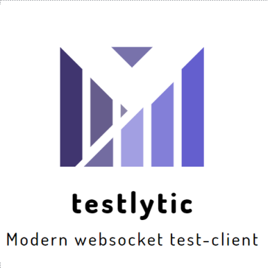

<div align="center">
<h1>testlytic</h1>
<hr>
<strong>An modern looking websocket testing client</strong><br><br>

 

</div>
<hr>
<div align="center">

</div>

# Project Information
Testlytic is a project I built, because I was unable to find a good-looking, fast and
functional websocket test-client. Therefore, I started to create my own one. It is a react app
wrapped into an electron app. This is the reason, why there is also an online version running
on github pages. 

# Installation
If you want to use the desktop. client you can download the latest installer from the
releases tab.

If you want to host the client yourself through the docker container follow these steps:
1. Pull the docker image from the registry
```shell
docker pull ghcr.io/mathisburger/testlytic
```
2. Start the container
```shell
docker run -d -p 3000:3000 ghcr.io/mathisburger/testlytic
```
3. You can access your local installation now on your browser under http://localhost:3000

# Contributing
If you want to contribute to the project check out the <a href="CONTRIBUTING.md">CONTRIBUTING.md</a>.
It contains all information you need for contributing to the testlytic project. Generally
everyone can contribute to the project. You just have to follow some development guidelines
to leave the codebase as clean as possible.

# Local development setup
If you want to setup the project for development follow these steps:
1. Clone the code from the repository
```shell
git clone github.com/mathisburger/testlytic
```
2. install yarn
```shell
npm install -g yarn
```
3. go into the project folder
```shell
cd testlytic
```   
4. install packages
```shell
yarn install
```
5. run the webapp to check, if it works
```shell
yarn react-start --open
```
